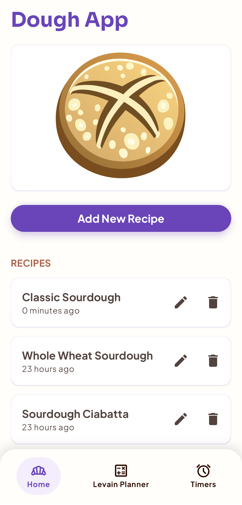
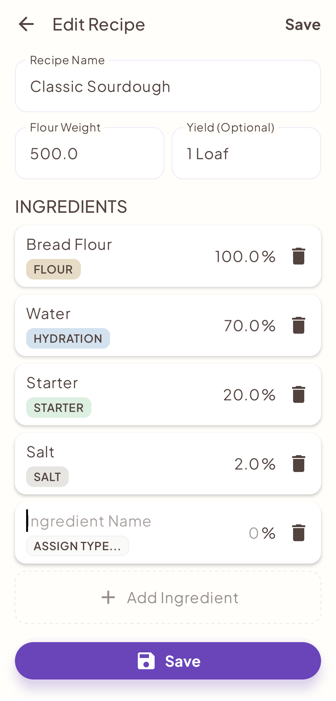
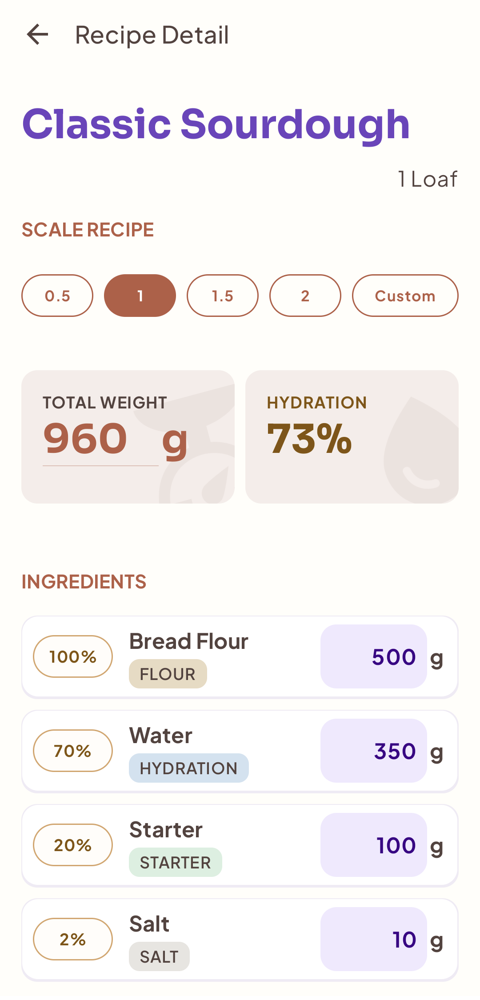
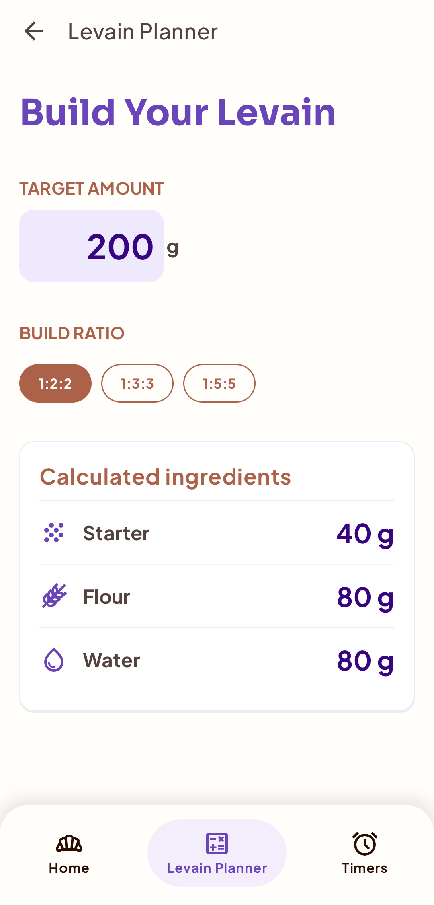

## Story Time

Every time I went to bake delicious, fresh sourdough, I had a choice. I could load up an ad-filled baking app that didn't quite do what I want, or I could get out the calculator. See, I don't bake from standard recipes; I like to experiment with different hydrations, different amounts of starter, scaling things up and down. So I thought, "I COULD make my own app..."

**But I had 0 knowledge of Android.** Never heard of Jetpack Compose or Room or Material 3. I had worked in Kotlin, but only for web projects. Just getting started seemed like a chore.

Then one day I was trying out Google Stitch and had a conversation. It quickly made the dough app in my imagination seem real. I could practically taste the well-calculated sourdough I would bake! This would also be the perfect chance to use AI in depth to accelerate development. So I downloaded Android Studio and got started.

Scroll down to the **What I Learned** section for what happened next.

---

## Starter Up

Starter Up is an Android application designed for sourdough bakers to scale recipes and calculate ingredients. My biggest priority is to make the app a good user experience.

> ⚠️ **Project Status: Work in Progress** ⚠️
> This repository is a live look at my development process. The app is functioning, but expect some messy code, in-progress features, and stray comments left by me or AI. You will see this change over the course of many commits. I get things to work first, then refactor to make the code actually maintainable.

---

## Tech Stack & Architecture
This project is built with modern Android standards to ensure scalability and maintainability.

*   **Language:** Kotlin
*   **UI:** Jetpack Compose (Declarative UI)
*   **Database:** Room (SQLite wrapper) for local persistence.
*   **Settings:** Jetpack DataStore for persistent last used values.
*   **Concurrency:** Kotlin Coroutines & Flow for asynchronous data streams and reactive state.
*   **Architecture:** MVVM (Model-View-ViewModel).

---

## Key Features
- [x] **Store recipes:** Add, edit, and view dough recipes using baker's percentages.
- [x] **Automated calculations:** Instantly scale the recipe by updating the weight of any ingredient.
- [x] **Levain planning:** Calculate ingredients for a target levain weight with a specific ratio (e.g. 1:2:2).
- [x] **Persistent values:** The app remembers the last used values for each recipe.
- [ ] **Recipe import/export:** (In Progress; currently imports an initial recipe on first install)
- [ ] **Theming:** Full Dynamic Color (Material 3) support. (In Progress)
- [ ] **Baking timers:** (Planned)
- [ ] **Image uploads:** Ability to attach photos to recipes. (Planned)

---

## Screenshots
|                Main Screen                 |                Edit Recipe                 |                 Recipe Detail                  |                  Levain Planner                  |
|:------------------------------------------:|:------------------------------------------:|:----------------------------------------------:|:------------------------------------------------:|
|  |  |  |  |

---

## ⚙️ Setup & Installation
To build and run this project locally, you will need:
1. **Android Studio:** Ladybug (2024.2.1) or newer.
2. **JDK 17:** Ensure your Android Studio Gradle settings are pointed to a Java 17 SDK (required for modern AGP).
3. **Android SDK:** The project is configured for Target SDK 35 and Min SDK 24 (Android 7.0).

**Steps to Run:**
1. Clone the Repo
2. Open in Android Studio.
3. Sync Gradle.
4. Select a physical device or an emulator and Run.

---

## 📄 License
This project is licensed under the Apache License 2.0 - see the [LICENSE](LICENSE) file for details.

---

## Story Time 2: What I Learned

This project has been a deep dive into **AI-accelerated development**. I used AI to generate features, help with typography and icons, write tests, and even brainstorm title ideas.

However, I learned that while AI could quickly get a screen functioning, I had to manually intervene to make sure the code followed sensible standards.

For example, when I first started, just about everything got dumped into MainActivity.kt. It made an activity for each screen. I asked if it recommended that I move different activities into different files, and it wholeheartedly did. (Thanks for telling me earlier.) It didn't bother mentioning (until I asked later) that having an activity for every screen has been outdated for years. (The separate files were good, but I had to make structural changes to the code.)

At some point it mentioned NavGraph in passing, and I asked, "What's that?"  
AI (paraphrased): Oh, it's just the standard that everyone uses since like years ago so that MainActivity.kt doesn't become a God object handling everything of course, duh.  

Ok, maybe it said it in a more polite and verbose way, with a respectful explanation about why God objects are bad, but close enough. I would have asked it why it didn't tell me earlier, but clearly the answer was:  
I didn't ask.

Needless to say, there has been and will continue to be a lot of refactoring involved.

(...Not that there wouldn't have been if I'd been muddling through without the help of AI, having started with 0 Android knowledge. But still.)

I also learned is that the Gemini Agent is really good at messing up gradle files if you let it get its grubby agentic hands on those. It is not (as of April 2026) a good package manager. Now, it may be a good package manager next month, or next year, but I'm not holding my breath.

But hey, it never gets tired of questions, "Explain this," "Explain that," "Why this," and "Please stop bringing up the bug I was trying to fix a few minutes ago and just answer this new question I have." (Gemini keeps bringing up the bug anyway.)

I didn't use Gemini exclusively. As I mentioned, screen layouts were inspired by Stitch, though I ended up changing quite a lot. I used Adobe Firefly to generate me some vectors to use as an icon/logo for this project. It came up with some pretty neat-looking stuff, though flawed considering my use case. I needed something more simplified, with more contrast. So I used the AI as a starting point and edited it:

|                                AI-generated                                |                                    My Edit                                     |
|:--------------------------------------------------------------------------:|:------------------------------------------------------------------------------:|
|  |  |

All in all, it feels like I took a crash course in Android and Jetpack Compose with a personal tutor. A tutor that, no doubt, has STILL omitted things that are common knowledge for, you know, **actual** Android developers... but I suppose that's what Reddit, Medium, and StackOverflow are for.
